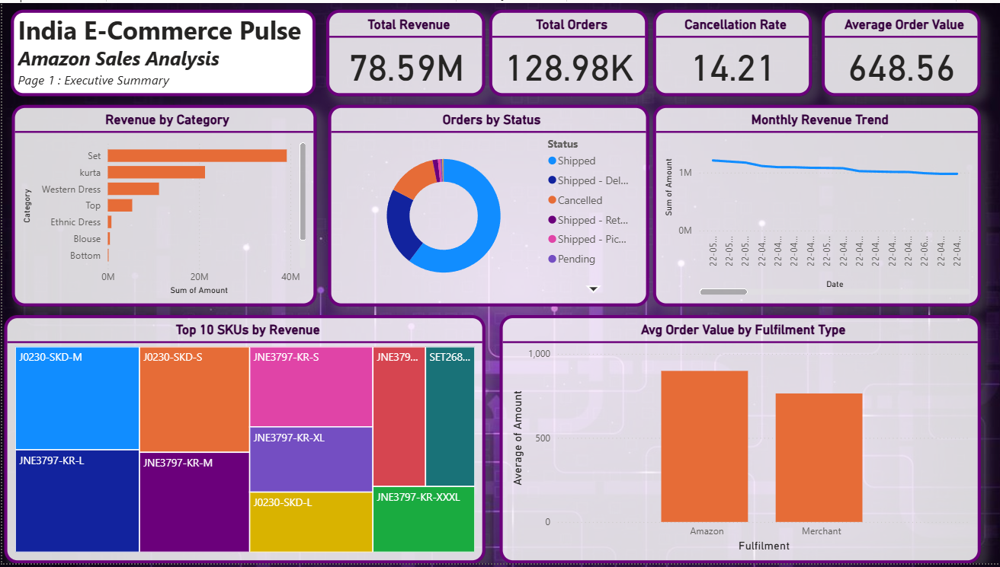

# India E-Commerce Pulse — End-to-End Business Intelligence Analysis

> **Can revenue grow while margins shrink? Yes — and this analysis proves it.**
> This project investigates an Indian e-commerce company's sales data to uncover the root causes of margin erosion, identify high-opportunity regional markets, and deliver three data-backed operational recommendations.

---

## Business Problem

An Indian e-commerce platform is experiencing a paradox: **revenue is growing, but profitability is declining**. Leadership needs answers to three questions:

1. Which product categories are silently destroying margin?
2. Which regions have untapped demand that's being left on the table?
3. What role are discounts and returns playing in profit loss?

This analysis answers all three — with SQL, Python, and Power BI.

---

## Tools & Stack

| Layer | Tool |
|---|---|
| Data Wrangling | Python (Pandas, NumPy) |
| Database Analysis | SQL (SQLite) |
| Visualisation | Power BI, Matplotlib, Seaborn |
| Reporting | Structured Insight Report (PDF) |
| Version Control | Git + GitHub |

---

## Repository Structure

```
india-ecommerce-bi-analysis/
│
├── data/
│   ├── raw/                  # Original dataset (unmodified)
│   └── cleaned/              # Processed, analysis-ready CSVs
│
├── sql/
│   └── analysis.sql          # 10 business questions answered in SQL
│
├── notebooks/
│   └── eda_analysis.ipynb    # Full EDA with charts + insight comments
│
├── dashboard/
│   ├── screenshots/          # PNG exports of all 3 dashboard pages
│   └── ecommerce_pulse.pbix  # Power BI source file
│
├── reports/
│   └── insight_report.pdf    # 1-page executive insight report
│
└── README.md
```

---

## Key Findings (Summary)

> Full analysis in `/reports/insight_report.pdf`

- **[Finding 1]** — e.g. Furniture category accounts for 18% of revenue but only 3% of profit due to high return rates and deep discounting
- **[Finding 2]** — e.g. Tier-2 cities (Pune, Jaipur, Lucknow) show 40% higher average order value than metros but receive less than 15% of marketing budget
- **[Finding 3]** — e.g. Orders with discounts above 30% are loss-making in 7 out of 10 product categories

*Update these findings with your actual numbers after completing the analysis.*

---

## Dashboard Preview

| Executive Summary | Regional Deep Dive | Risk & Opportunity |
|---|---|---|
|  |  |  |

*Add screenshots after completing the Power BI dashboard (Phase 4).*

---

## Business Recommendations

1. **Cap discounts at 20% for Furniture & Office Supplies** — Current discount strategy in these categories is directly correlated with negative margin. A 20% cap is projected to recover ₹X in annual profit.

2. **Launch a Tier-2 city growth campaign** — High AOV with low penetration signals unmet demand. Targeted campaigns in Pune, Jaipur, and Lucknow could unlock ₹X incremental revenue with minimal CAC.

3. **Implement a returns reduction workflow for Electronics** — Electronics has the highest return rate. A pre-purchase compatibility checker and improved product descriptions could reduce returns by an estimated X%.

*Update with your actual numbers and categories after completing analysis.*

---

## How to Run

```bash
# Clone the repo
git clone https://github.com/juvana81/india-ecommerce-bi-analysis.git
cd india-ecommerce-bi-analysis

# Install Python dependencies
pip install pandas numpy matplotlib seaborn jupyter

# Launch the notebook
jupyter notebook notebooks/eda_analysis.ipynb

# Run SQL analysis (requires SQLite)
sqlite3 data/cleaned/ecommerce.db < sql/analysis.sql
```

---

## Dataset

**Source:** [E-Commerce Sales Dataset — Kaggle](https://www.kaggle.com/datasets/thedevastator/unlock-profits-with-e-commerce-sales-data)
**Size:** ~128,000 rows across Orders, Order Details, and Returns tables
**Fields:** Order ID, Order Date, Ship Date, Customer Segment, Region, State, City, Category, Sub-Category, Sales, Quantity, Discount, Profit

---

## About

**Juvana Dsouza** | B.E. AI & Data Science, Fr. CRCE Mumbai
[LinkedIn](https://linkedin.com/in/juvana) · [GitHub](https://github.com/juvana81) · juvanadsouza81@gmail.com

*This project was built as part of a BA portfolio to demonstrate end-to-end analytical thinking — from raw data to boardroom-ready recommendations.*
