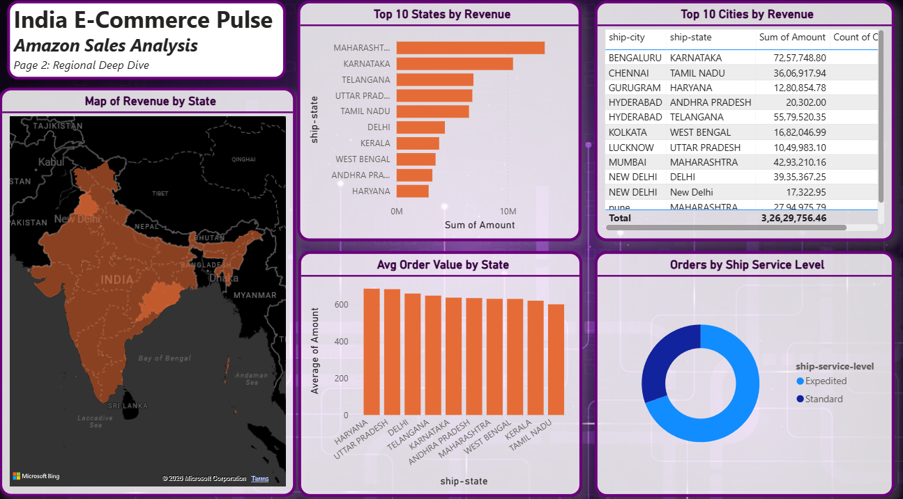
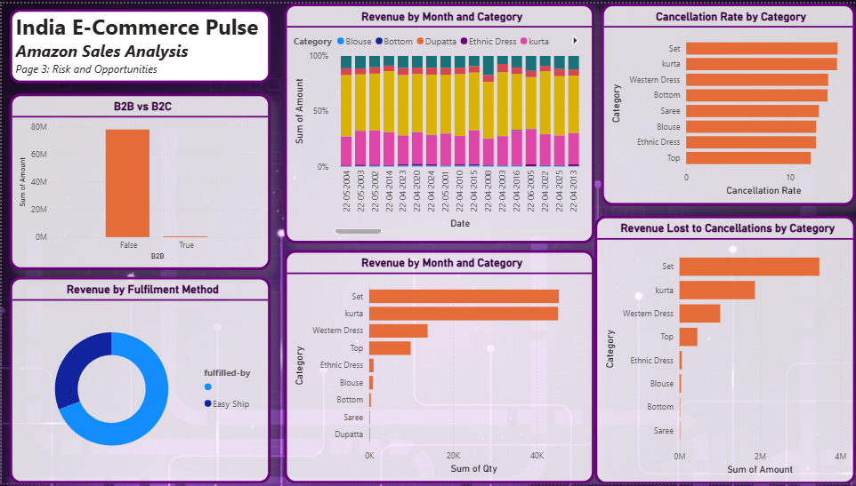

# India E-Commerce Pulse — End-to-End Business Intelligence Analysis

> **Can revenue grow while margins shrink? Yes — and this analysis proves it.**  
> This project investigates 128,975 Amazon India transactions to uncover the root causes of revenue leakage, identify high-opportunity regional markets, and deliver three data-backed operational recommendations.

---

## Business Problem

An Indian e-commerce platform selling apparel on Amazon is experiencing a critical paradox — order volumes remain strong at 128,975 transactions, yet significant revenue is being eroded through high cancellation rates, category-level inefficiencies, and geographic concentration risk.

**Three questions this analysis answers:**
1. Which product categories are silently destroying revenue through cancellations?
2. Which regions have untapped demand that's being left on the table?
3. What is the real cost of the platform's current order fulfilment strategy?

---

## Tools & Stack

| Layer | Tool |
|---|---|
| Data Wrangling | Python (Pandas, NumPy) |
| Database Analysis | SQL (SQLite) — 10 business queries |
| Visualisation | Power BI (15 visuals, 3 pages), Matplotlib, Seaborn |
| Reporting | Executive Insight Report (PDF) |
| Version Control | Git + GitHub |

---

## Repository Structure

```
india-ecommerce-bi-analysis/
│
├── data/
│   ├── raw/                        # Original dataset (unmodified)
│   └── cleaned/                    # Processed, analysis-ready CSVs
│
├── sql/
│   └── analysis.sql                # 10 business questions answered in SQL
│
├── notebooks/
│   └── eda_analysis.ipynb          # Full EDA — 8 charts + insight comments
│
├── dashboard/
│   ├── screenshots/                # PNG exports of all 3 dashboard pages
│   └── ecommerce_pulse_dashboard.pbix  # Power BI source file
│
├── reports/
│   └── insight_report.pdf          # Executive insight report
│
└── README.md
```

---

## Key Findings

> Full analysis in `/reports/insight_report.pdf`

| # | Finding | Impact |
|---|---|---|
| 1 | **Cancellations cost ₹69.2 Lakhs** — 8.35% of all orders cancelled | ₹69,19,284 in lost GMV |
| 2 | **"Set" earns 83% more per order than Kurta** — ₹834 vs ₹457 AOV, same volume | Underinvested high-value category |
| 3 | **Maharashtra + Karnataka = 28% of all revenue** — heavy geographic concentration | High business risk if demand shifts |
| 4 | **Ladakh (₹929 AOV), Nagaland (₹825 AOV)** — high spend, near-zero penetration | Untapped opportunity markets |
| 5 | **Revenue dropped 18.4% from April to June** — ₹26.2M → ₹21.4M | Seasonal decline requiring investigation |

---

## Dashboard Preview

**Page 1 — Executive Summary**


**Page 2 — Regional Deep Dive**


**Page 3 — Risk & Opportunity**


---

## Business Recommendations

**1. Reduce Cancellations in Top Categories — Target: <10%**
Set and Kurta together lose ₹40L+ to cancellations at 14.5% cancellation rate. Immediate actions: root cause analysis via customer exit surveys, real-time size recommendation engine, and cancellation reason tagging. Reducing to 10% recovers an estimated **₹20L+ annually**.

**2. Reallocate Marketing Budget Toward High-AOV Categories**
Sets generate ₹834 per order vs ₹457 for Kurtas at the same acquisition cost. Shifting 20-25% of Kurta ad spend to Sets and Western Dress (₹764 AOV) requires no new customers — just better spend allocation. Projected impact: **12-15% increase in revenue per marketing rupee**.

**3. Launch Targeted Campaigns in Opportunity States**
Ladakh, Nagaland, and Chandigarh show above-average AOV (₹800-930) with near-zero order volumes. A 60-day targeted digital campaign before committing to logistics expansion could unlock significant incremental revenue at low CAC.

---

## SQL Analysis — 10 Business Questions

| # | Question | Insight |
|---|---|---|
| Q1 | Revenue by order status | ₹69.2L lost to cancellations |
| Q2 | Revenue vs volume by category | Sets earn 83% more per order than Kurtas |
| Q3 | Top 10 states by revenue | Maharashtra leads at ₹1.22 Cr |
| Q4 | High AOV, low volume states | Ladakh, Nagaland = opportunity markets |
| Q5 | Cancellation rate by category | Set + Kurta = 14.5% cancel rate |
| Q6 | B2B vs B2C comparison | B2B earns ₹701 avg vs B2C ₹648 |
| Q7 | Fulfilment method performance | Easy Ship handles 39K orders |
| Q8 | Monthly revenue trend | 18.4% decline Apr → Jun |
| Q9 | Top sizes by units sold | M, L, XL = top 3 sizes |
| Q10 | Top 10 cities by revenue | Bengaluru leads at ₹72.5L |

---

## Python EDA — 8 Charts

| # | Chart | Business Question |
|---|---|---|
| 1 | Revenue by Order Status | How much revenue is lost to cancellations? |
| 2 | Category Revenue vs AOV | Which categories earn the most per order? |
| 3 | Cancellation Rate by Category | Which categories bleed the most revenue? |
| 4 | Top 10 States by Revenue | Where is revenue concentrated? |
| 5 | Opportunity Markets Scatter | Where can we grow with minimal spend? |
| 6 | Monthly Revenue Trend | Is revenue growing or declining? |
| 7 | B2B vs B2C Performance | Which segment is more valuable? |
| 8 | Top 10 Cities by Revenue | Which cities deserve hyperlocal investment? |

---

## How to Run

```bash
# Clone the repo
git clone https://github.com/juvana81/india-ecommerce-bi-analysis.git
cd india-ecommerce-bi-analysis

# Install Python dependencies
pip install pandas numpy matplotlib seaborn jupyter

# Launch the notebook
jupyter notebook notebooks/eda_analysis.ipynb

# Run SQL analysis (requires SQLite)
python run_sql_analysis.py
```

---

## Dataset

**Source:** [Amazon Sale Report — Kaggle](https://www.kaggle.com/datasets/thedevastator/unlock-profits-with-e-commerce-sales-data)  
**Size:** 128,975 rows  
**Fields:** Order ID, Date, Status, Category, Size, Amount, Qty, Ship-City, Ship-State, Fulfilment, B2B  

---

## About

**Juvana Dsouza** | B.E. AI & Data Science, Fr. CRCE Mumbai  
[LinkedIn](https://linkedin.com/in/juvana) · [GitHub](https://github.com/juvana81) · juvanadsouza81@gmail.com

*This project was built to demonstrate end-to-end analytical thinking — from raw data to boardroom-ready recommendations — as part of a Business Analyst portfolio.*
